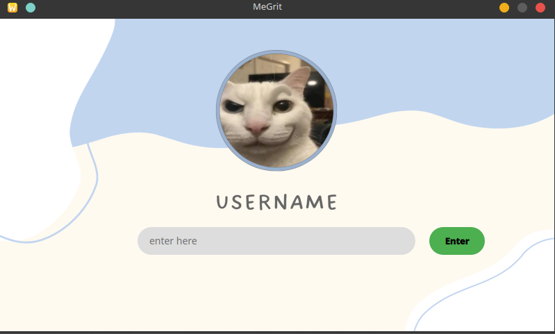
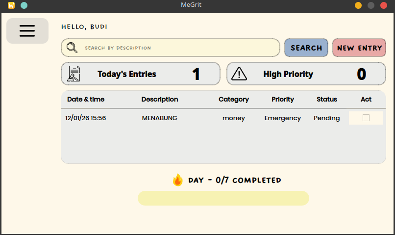
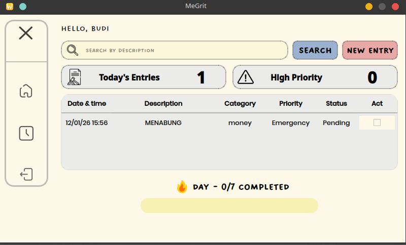
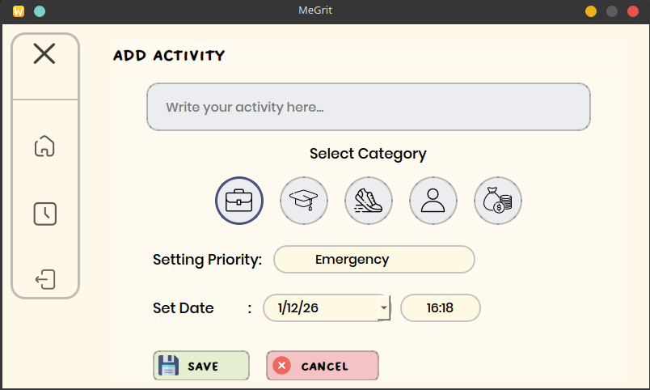
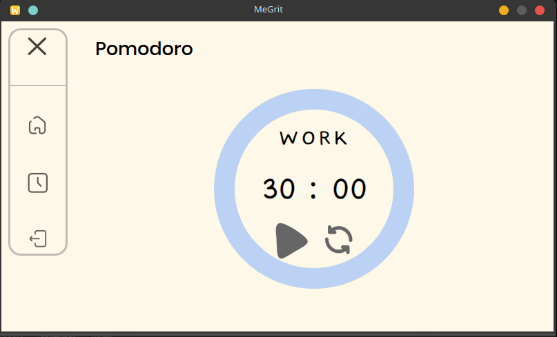

# MeGrit - Productivity & Task Management App

**MeGrit** adalah aplikasi manajemen produktivitas berbasis desktop yang dibangun menggunakan **Python** dan **PyQt5**. Aplikasi ini dirancang untuk membantu pengguna mengelola tugas sehari-hari, meningkatkan fokus dengan teknik Pomodoro, dan melacak kebiasaan (habit tracking) dengan antarmuka yang bersih dan estetis.

**MeGrit** is a desktop-based productivity management application built using **Python** and **PyQt5**. It is designed to help users manage daily tasks, improve focus using the Pomodoro technique, and track habits with a clean and aesthetic interface.

---

## 📸 Screenshots / Tangkapan Layar

| Login Screen | Dashboard (Empty) |
|:---:|:---:|
|  |  |

| Dashboard (Filled) | Add Activity |
|:---:|:---:|
|  |  |

| Pomodoro Timer |
|:---:|
|  |

---

## ✨ Features / Fitur

### 🇮🇩 Bahasa Indonesia
1.  **Task Management**: Tambahkan, edit, dan kelola tugas harian dengan kategori (Work, Study, Sport, dll) dan prioritas (Emergency, High, Low).
2.  **Multi-User Support**: Setiap pengguna memiliki daftar tugasnya sendiri (login unik).
3.  **Pomodoro Timer**: Fokus bekerja dengan timer Pomodoro visual (analog dial) yang dapat disesuaikan.
4.  **Habit/Streak Tracker**: Lacak konsistensi penyelesaian tugas harian Anda.
5.  **Visual Time Picker**: Widget jam visual (dial) yang interaktif untuk mengatur waktu tugas.
6.  **Responsive UI**: Tampilan yang responsif dan estetis (tema Cream/Pastel).

### 🇬🇧 English
1.  **Task Management**: Add, edit, and manage daily tasks with categories (Work, Study, Sport, etc.) and priorities (Emergency, High, Low).
2.  **Multi-User Support**: Each user has their own isolated task list (unique login).
3.  **Pomodoro Timer**: Focus on work with a customizable visual Pomodoro timer (analog dial).
4.  **Habit/Streak Tracker**: Track your daily task completion consistency.
5.  **Visual Time Picker**: Interactive visual clock widget (dial) for setting task times.
6.  **Responsive UI**: Responsive and aesthetic interface (Cream/Pastel theme).

---

## 🛠️ Tech Stack / Teknologi

*   **Language**: Python 3.x
*   **GUI Framework**: PyQt5
*   **Data Storage**: JSON (Local Persistence)
*   **Assets**: Custom Images & Fonts (Dreaming Outloud, Poppins)

## 🚀 How to Run / Cara Menjalankan

1.  **Install Requirements / Instal Dependensi**:
    ```bash
    pip install PyQt5
    ```

2.  **Run Application / Jalankan Aplikasi**:
    ```bash
    python -m megrit.main
    ```

---

## 📂 Project Structure / Struktur Proyek

```
MeGrit/
├── megrit/
│   ├── assets/         # Images, Icons, Fonts, Sounds
│   ├── components/     # UI Components (Navbar, Cards, TimePicker)
│   ├── data/           # JSON Data (tasks.json, users.json)
│   ├── logic/          # Business Logic (Managers, Filter)
│   ├── ui/             # Screens (Login, Dashboard, AddTask, Pomodoro)
│   └── main.py         # Entry Point
├── screenshots/        # Documentation Images
└── README.md
```

---

Created by **Kelompok 1**.
